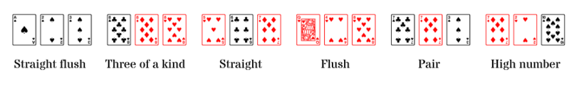

# Three card poker



Al Three Card Poker es poden fer les següents figures:

- **Straight flush**: 3 cartes amb números consecutius del mateix pal

- **Three of a kind**: 3 cartes del mateix número

- **Straight**: 3 cartes amb números consecutius

- **Flush**: 3 cartes del mateix pal

- **Pair**: 2 cartes del mateix número

- **High number**: cap de les anteriors

En la nostra versió del joc, jugarem només amb els números, no amb els pals. Així, les figures possibles seran:

- **Three of a kind**

- **Straight**

- **Pair**

- **High number**

## Input

L'entrada consta de 3 números enters corresponents als números de les cartes.

No hi ha

## Output

S'imprimirà la figura de més valor.

{     |  |  |   }

## Tests

### Test 1.54
```input
1 1 1
```
```output
THREE OF A KIND
```

### Test 1.54
```input
1 1 1
```
```output
THREE OF A KIND
```

### Test private 1.54
```input
1 1 2
```
```output
PAIR
```

### Test private 1.54
```input
1 1 3
```
```output
PAIR
```

### Test private 1.54
```input
1 1 4
```
```output
PAIR
```

### Test private 1.54
```input
1 2 1
```
```output
PAIR
```

### Test private 1.54
```input
1 2 2
```
```output
PAIR
```

### Test private 1.54
```input
1 2 3
```
```output
STRAIGHT
```

### Test private 1.54
```input
1 2 4
```
```output
HIGH CARD
```

### Test private 1.54
```input
1 3 1
```
```output
PAIR
```

### Test private 1.54
```input
1 3 2
```
```output
STRAIGHT
```

### Test private 1.54
```input
1 3 3
```
```output
PAIR
```

### Test private 1.54
```input
1 3 4
```
```output
HIGH CARD
```

### Test private 1.54
```input
1 4 1
```
```output
PAIR
```

### Test private 1.54
```input
1 4 2
```
```output
HIGH CARD
```

### Test private 1.54
```input
1 4 3
```
```output
HIGH CARD
```

### Test private 1.54
```input
1 4 4
```
```output
PAIR
```

### Test private 1.54
```input
2 1 1
```
```output
PAIR
```

### Test private 1.54
```input
2 1 2
```
```output
PAIR
```

### Test private 1.54
```input
2 1 3
```
```output
STRAIGHT
```

### Test private 1.54
```input
2 1 4
```
```output
HIGH CARD
```

### Test private 1.54
```input
2 2 1
```
```output
PAIR
```

### Test private 1.54
```input
2 2 2
```
```output
THREE OF A KIND
```

### Test private 1.54
```input
2 2 3
```
```output
PAIR
```

### Test private 1.54
```input
2 2 4
```
```output
PAIR
```

### Test private 1.54
```input
2 3 1
```
```output
STRAIGHT
```

### Test private 1.54
```input
2 3 2
```
```output
PAIR
```

### Test private 1.54
```input
2 3 3
```
```output
PAIR
```

### Test private 1.54
```input
2 3 4
```
```output
STRAIGHT
```

### Test private 1.54
```input
2 4 1
```
```output
HIGH CARD
```

### Test private 1.54
```input
2 4 2
```
```output
PAIR
```

### Test private 1.54
```input
2 4 3
```
```output
STRAIGHT
```

### Test private 1.54
```input
2 4 4
```
```output
PAIR
```

### Test private 1.54
```input
3 1 1
```
```output
PAIR
```

### Test private 1.54
```input
3 1 2
```
```output
STRAIGHT
```

### Test private 1.54
```input
3 1 3
```
```output
PAIR
```

### Test private 1.54
```input
3 1 4
```
```output
HIGH CARD
```

### Test private 1.54
```input
3 2 1
```
```output
STRAIGHT
```

### Test private 1.54
```input
3 2 2
```
```output
PAIR
```

### Test private 1.54
```input
3 2 3
```
```output
PAIR
```

### Test private 1.54
```input
3 2 4
```
```output
STRAIGHT
```

### Test private 1.54
```input
3 3 1
```
```output
PAIR
```

### Test private 1.54
```input
3 3 2
```
```output
PAIR
```

### Test private 1.54
```input
3 3 3
```
```output
THREE OF A KIND
```

### Test private 1.54
```input
3 3 4
```
```output
PAIR
```

### Test private 1.54
```input
3 4 1
```
```output
HIGH CARD
```

### Test private 1.54
```input
3 4 2
```
```output
STRAIGHT
```

### Test private 1.54
```input
3 4 3
```
```output
PAIR
```

### Test private 1.54
```input
3 4 4
```
```output
PAIR
```

### Test private 1.54
```input
4 1 1
```
```output
PAIR
```

### Test private 1.54
```input
4 1 2
```
```output
HIGH CARD
```

### Test private 1.54
```input
4 1 3
```
```output
HIGH CARD
```

### Test private 1.54
```input
4 1 4
```
```output
PAIR
```

### Test private 1.54
```input
4 2 1
```
```output
HIGH CARD
```

### Test private 1.54
```input
4 2 2
```
```output
PAIR
```

### Test private 1.54
```input
4 2 3
```
```output
STRAIGHT
```

### Test private 1.54
```input
4 2 4
```
```output
PAIR
```

### Test private 1.54
```input
4 3 1
```
```output
HIGH CARD
```

### Test private 1.54
```input
4 3 2
```
```output
STRAIGHT
```

### Test private 1.54
```input
4 3 3
```
```output
PAIR
```

### Test private 1.54
```input
4 3 4
```
```output
PAIR
```

### Test private 1.54
```input
4 4 1
```
```output
PAIR
```

### Test private 1.54
```input
4 4 2
```
```output
PAIR
```

### Test private 1.54
```input
4 4 3
```
```output
PAIR
```

### Test private 1.44
```input
4 4 4
```
```output
THREE OF A KIND
```
