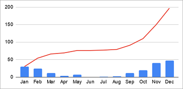

# Vendes acumulades



La venda acumulada d'un mes és sumar a les vendes d'un mes les vendes dels mesos anteriors.

A partir de les dades de vendes mensuals, calcula les vendes acumulades de cada mes.

## Input

El primer número  indica la quantitat de mesos.

A continuació ve la quantitat de vendes de cada mes.

## Output

S'imprimiran les vendes en format Array: `[0, 0, 0, 0]`

## Tests

### Test
```input
5
1 2 3 4 5
```
```output
[1, 3, 6, 10, 15]
```

### Test
```input
3
15 10 5
```
```output
[15, 25, 30]
```

### Test
```input
4
0 0 1 1
```
```output
[0, 0, 1, 2]
```

### Test
```input
3
1 0 0
```
```output
[1, 1, 1]
```

### Test
```input
6
0 0 0 0 0 0
```
```output
[0, 0, 0, 0, 0, 0]
```
