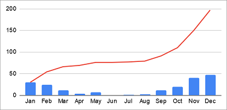

# Vendes acumulades

La venda acumulada d'un mes és sumar a les vendes d'un mes les vendes dels mesos anteriors.

A partir de les dades de vendes mensuals, calcula les vendes acumulades de cada mes.

## Input

El primer número  indica la quantitat de mesos.

A continuació ve la quantitat de vendes de cada mes.

## Output

S'imprimiran les vendes en format Array: `[0, 0, 0, 0]`
