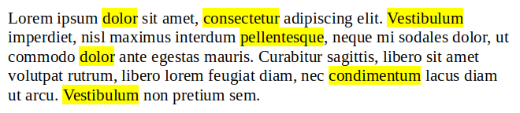

# Word highlight



Dado un texto, resalta las palabras que se indiquen.

Para resaltar una palabra, escríbela entre guiones bajos `_`.

# Entrada

La entrada consta de dos líneas. La primera contiene el texto, y la segunda las palabras a resaltar. En cada línea se especifica en primer lugar el número de palabras

# Salida

Se imprimirá en una sola línea cada palabra del texto, separadas por espacio en blanco, y resaltando entre guiones bajos `_` las palabras indicadas.

## Tests

### Test 10
```input
4 java runs very fast
1 very
```
```output
java runs _very_ fast
```

### Test 10
```input
4 write once run everywhere
2 once everywhere
```
```output
write _once_ run _everywhere_
```

### Test 10
```input
4 write once test everywhere
1 write
```
```output
_write_ once test everywhere
```

### Test 10
```input
8 java is for programmers and for end users
3 java for end
```
```output
_java_ is _for_ programmers and _for_ _end_ users
```

### Test 10
```input
35 Oracle Java is the #1 programming language and development platform it reduces costs shortens development timeframes drives innovation and improves application services Java continues to be the development platform of choice for enterprises and developers
4 Java development #1 choice
```
```output
Oracle _Java_ is the _#1_ programming language and _development_ platform it reduces costs shortens _development_ timeframes drives innovation and improves application services _Java_ continues to be the _development_ platform of _choice_ for enterprises and developers
```

### Test private 10
```input
10 a b c d e f g h i j
5 b g a c f
```
```output
_a_ _b_ _c_ d e _f_ _g_ h i j
```
