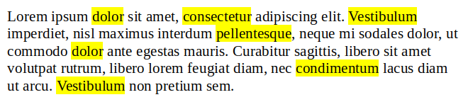

# Word highlight

Dado un texto, resalta las palabras que se indiquen.

Para resaltar una palabra, escríbela entre guiones bajos `_`.

# Entrada

La entrada consta de dos líneas. La primera contiene el texto, y la segunda las palabras a resaltar. En cada línea se especifica en primer lugar el número de palabras

# Salida

Se imprimirá en una sola línea cada palabra del texto, separadas por espacio en blanco, y resaltando entre guiones bajos `_` las palabras indicadas.